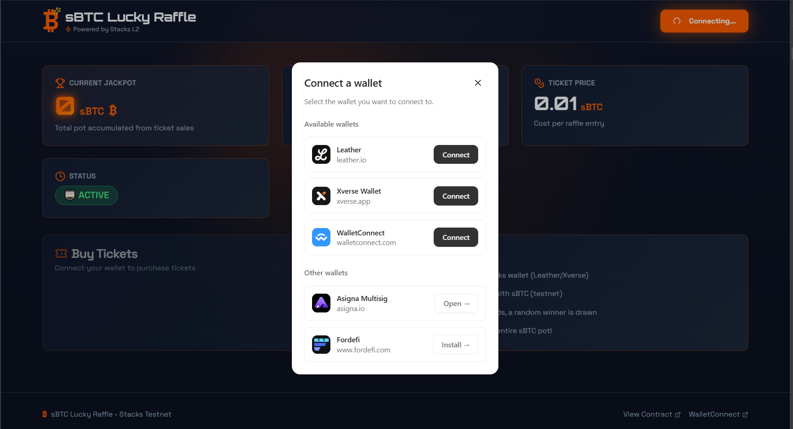

# SBTC Lucky Raffle

[](https://stacks.co/)
[](https://clarity-lang.org/)
[](https://reactjs.org/)
[](https://vitejs.dev/)
[](https://nodejs.org/)
[](LICENSE)

A full-stack decentralized raffle system built on the Stacks blockchain. Features a React frontend with wallet connectivity using Stacks libraries, and Clarity smart contracts for secure raffle operations using sBTC tokens.



## Overview

This project implements a full-stack decentralized raffle system on the Stacks blockchain, combining a modern React frontend with secure Clarity smart contracts. Users can connect their Stacks wallets, purchase raffle tickets using sBTC tokens, and participate in transparent, blockchain-based raffles where winners are selected through a pseudo-random process based on block height.

The project is structured as a monorepo with the following components:

- **`clarity-contract/`**: Core smart contracts and testing infrastructure
  - `sbtc-token.clar`: SIP-010 compliant fungible token representing sBTC
  - `sbtc-lucky-raffle.clar`: Main raffle contract managing tickets, winner selection, and prize distribution
  - Comprehensive test suite using Vitest and Clarinet SDK
  - Deployment configurations for Devnet, Testnet, and Mainnet

- **Frontend**: React 19.2.3 application with modern UI components
  - Built with Vite for fast development and optimized builds
  - Shadcn/UI components for polished user interface
  - Wallet connectivity using @stacks/connect, @stacks/network, and @stacks/transactions
  - Real-time interaction with deployed smart contracts

## Key Features

- **Secure Ticket Purchasing**: Buy raffle tickets using sBTC tokens via smart contracts
- **Pseudo-Random Winner Selection**: Based on blockchain block height for transparency
- **Owner-Controlled Management**: Contract owner can draw winners and reset raffles
- **Transparent Prize Pool**: All balances and transactions are publicly verifiable
- **SIP-010 Compliance**: sBTC token follows Stacks token standards
- **Modern React Frontend**: Built with React 19.2.3, Vite, and Shadcn/UI for optimal UX
- **Wallet Integration**: Seamless wallet connectivity using Stacks libraries (@stacks/connect, @stacks/network, @stacks/transactions)
- **Real-time Updates**: Live interaction with blockchain state and contract events
- **Comprehensive Testing**: Full test coverage for both contracts and frontend components

## Quick Start

### Prerequisites

- [Node.js](https://nodejs.org/) (version 18 or higher)
- [Clarinet](https://github.com/hirosystems/clarinet) (Stacks development framework)
- A Stacks-compatible wallet (e.g., Leather, Xverse)

### Installation

1. **Clone the repository**:
   ```bash
   git clone <repository-url>
   cd sbtcRaffle
   ```

2. **Install frontend dependencies**:
   ```bash
   npm install
   ```

3. **Set up environment variables**:
   Create a `.env` file in the root directory with your wallet configuration:
   ```
   VITE_STACKS_NETWORK=testnet
   VITE_CONTRACT_ADDRESS=STGDS0Y17973EN5TCHNHGJJ9B31XWQ5YXBQ0KQ2Y.sbtc-lucky-raffle
   ```

4. **Install Clarinet** (for contract development):
   ```bash
   # Follow instructions at https://github.com/hirosystems/clarinet
   ```

### Development Workflow

#### Frontend Development
1. **Start the development server**:
   ```bash
   npm run dev
   ```

2. **Build for production**:
   ```bash
   npm run build
   ```

#### Contract Development
1. **Navigate to contract directory**:
   ```bash
   cd clarity-contract
   ```

2. **Check contracts for syntax errors**:
   ```bash
   clarinet check
   ```

3. **Run the test suite**:
   ```bash
   npm test
   ```

4. **Start development console**:
   ```bash
   clarinet console
   ```

## Deployment

The contracts are currently deployed on Stacks testnet. See [clarity-contract/README.md](clarity-contract/README.md) for detailed deployment information and usage examples.

- **Contract Address**: `STGDS0Y17973EN5TCHNHGJJ9B31XWQ5YXBQ0KQ2Y.sbtc-lucky-raffle`
- **Network**: Stacks Testnet
- **Explorer**: [View on Stacks Explorer](https://explorer.stacks.co/)

## Usage

### Frontend Application

1. **Connect Wallet**: Use the frontend to connect your Stacks wallet (Leather, Xverse, etc.)
2. **Purchase Tickets**: Buy raffle tickets directly through the UI using sBTC tokens
3. **View Raffle Status**: Monitor ticket sales, prize pool, and winner announcements
4. **Claim Prizes**: Winners can claim their prizes through the connected wallet

The frontend integrates with the deployed smart contracts using the Stacks JavaScript libraries for seamless blockchain interaction.

### Smart Contract Interaction

For direct contract calls or advanced usage, see the examples below:

#### Buying Tickets
```clarity
;; Purchase 5 raffle tickets (0.05 sBTC total)
(contract-call? 'STGDS0Y17973EN5TCHNHGJJ9B31XWQ5YXBQ0KQ2Y.sbtc-lucky-raffle buy-tickets u5)
```

#### Drawing Winner (Owner Only)
```clarity
;; Select winner using block height randomness
(contract-call? 'STGDS0Y17973EN5TCHNHGJJ9B31XWQ5YXBQ0KQ2Y.sbtc-lucky-raffle draw-winner)
```

#### Claiming Prize (Winner Only)
```clarity
;; Winner claims the entire prize pool
(contract-call? 'STGDS0Y17973EN5TCHNHGJJ9B31XWQ5YXBQ0KQ2Y.sbtc-lucky-raffle claim-prize)
```

## Project Structure

```
sbtcRaffle/
├── clarity-contract/          # Smart contracts and tests
│   ├── contracts/            # Clarity smart contracts
│   │   ├── sbtc-token.clar
│   │   └── sbtc-lucky-raffle.clar
│   ├── tests/                # Test files
│   ├── settings/             # Network configurations
│   ├── deployments/          # Deployment plans
│   ├── package.json          # Node.js dependencies
│   └── README.md             # Contract-specific documentation
├── src/                      # React frontend source code
│   ├── components/           # Reusable UI components (Shadcn/UI)
│   ├── pages/                # Application pages
│   ├── hooks/                # Custom React hooks
│   ├── lib/                  # Utility functions and configurations
│   └── types/                # TypeScript type definitions
├── public/                   # Static assets
├── .env                      # Environment variables (wallet config)
├── package.json              # Frontend dependencies and scripts
├── vite.config.ts            # Vite build configuration
├── tailwind.config.ts        # Tailwind CSS configuration
├── .gitignore               # Git ignore rules
├── commit-contract.ps1       # Contract commit script
├── commit-project.ps1        # Full project commit script
└── README.md                # This file
```

## Testing Strategy

The project includes a comprehensive test suite covering:
- Ticket purchasing and validation
- Winner selection algorithm
- Prize claiming functionality
- Error handling and edge cases
- Security validations

Run tests with:
```bash
cd clarity-contract
npm test
```

## Contributing

We welcome contributions! Please see the [contributing guidelines](clarity-contract/README.md#contributing) in the contract README.

### Development Guidelines

- Follow Clarity language best practices
- Add tests for all new functionality
- Update documentation for any changes
- Ensure all tests pass before submitting PRs

## Security Considerations

- Winner selection uses block height pseudo-randomness (suitable for fun raffles, not high-stakes)
- All token transfers include proper validation
- Contract owner controls critical operations
- Full transparency through public blockchain state

## License

This project is licensed under the ISC License. See the LICENSE file for details.

## Resources

- [Stacks Documentation](https://docs.stacks.co/)
- [Clarity Language Reference](https://clarity-lang.org/)
- [Clarinet Documentation](https://github.com/hirosystems/clarinet)
- [SIP-010 Token Standard](https://github.com/stacksgov/sips/blob/main/sips/sip-010/sip-010-fungible-token-standard.md)
- [Stacks Explorer](https://explorer.stacks.co/)

## Support

For questions or support:
- Open an issue on GitHub
- Join the [Stacks Discord](https://discord.gg/stacks)
- Check the [Stacks documentation](https://docs.stacks.co/)

---

Built with ❤️ on the Stacks blockchain</content>
<parameter name="filePath">g:\2025\Learning\Blockchain\Stacks\Counter\sbtcRaffle\README.md